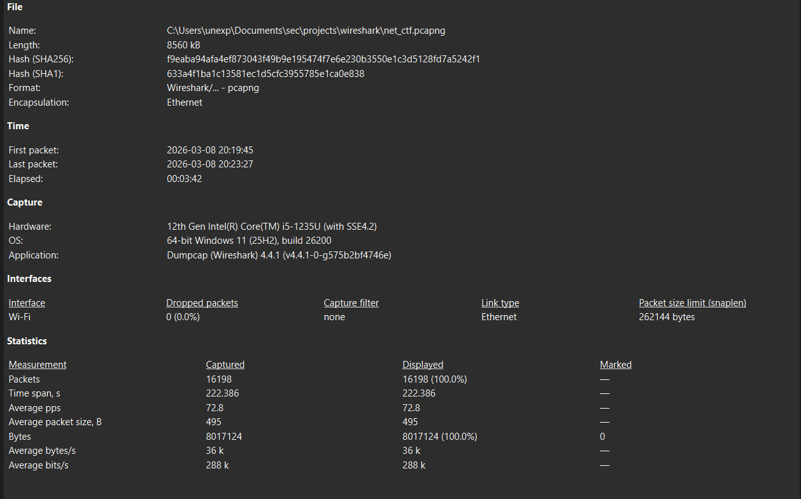

# Wireshark Packet Capture Analysis

This project is about learning how to read packet capture files with Wireshark.

A packet capture, often called a PCAP, is a saved record of network traffic. It lets you look back at what devices were saying to each other: who connected to whom, which ports were used, which protocols appeared, and what patterns stand out.

The goal here is not to memorize every Wireshark feature. The goal is to become comfortable opening a capture file, asking simple questions, filtering the traffic, and writing down what the evidence shows.

## Who This Is For

This is for people who already know the very basics of networking and want to get better at practical packet analysis.

You do not need to be advanced, but it helps if you already understand ideas like:

- An IP address identifies a device on a network.
- A port is like a doorway into a service, such as web traffic on port 80 or 443.
- A protocol is a rule set for communication, such as TCP, DNS, HTTP, or TLS.
- A packet is one small piece of network communication.

If you have opened Wireshark before and felt like there was too much information on the screen, this beginner section is meant to slow things down.

## Prerequisites

Before following this project, you should already have some basic networking background. You do not need to be an expert, but you should not be seeing every idea here for the first time.

This project will make more sense if you already know:

- **Basic computer networking:** what a client and server are, how devices communicate, and why machines need addresses to find each other.
- **IP addresses and ports:** an IP address points to a device, and a port points to a specific service or application on that device.
- **The TCP/IP model:** the practical model used to understand network communication on real systems. For example, IP handles addressing, TCP and UDP handle transport, and protocols like HTTP or DNS sit above them.
- **The OSI model:** a layered way to think about networking. You do not need to recite all seven layers perfectly, but you should understand the idea that network communication is built in layers.
- **Common protocols:** at least the basic purpose of TCP, UDP, DNS, HTTP, HTTPS/TLS, ICMP, and ARP.
- **Normal network behavior:** what ordinary browsing, DNS lookup, ping, and application traffic roughly look like.
- **Common suspicious patterns:** at least the names and simple meanings of scanning, brute-force attempts, beaconing, exfiltration, and denial-of-service activity.

Here is the simple version of those suspicious patterns:

- **Scanning** means a machine is checking what hosts or ports are reachable.
- **Brute force** means repeated login or access attempts, usually trying many guesses.
- **Beaconing** means a machine contacts another system again and again on a schedule, which can be normal for some apps but suspicious in the wrong context.
- **Exfiltration** means data is leaving a system or network where it should not.
- **Denial of service** means traffic is trying to make a system slow, unstable, or unavailable.

If these words are familiar but not fully clear yet, that is fine. This project can help strengthen them. If all of them are completely new, it is better to first spend some time on basic networking before trying to analyze packet captures. Now then,

## What Is Wireshark?

Wireshark is a free tool for looking at network traffic.

It can capture traffic live from your network card, or it can open saved capture files like the ones in this repository. When you open a file, Wireshark shows each packet and lets you inspect it layer by layer.

People use Wireshark for things like:

- Understanding how applications talk over the network.
- Troubleshooting connection problems.
- Checking which devices are communicating.
- Looking for unusual or suspicious traffic.
- Practicing how real network analysis feels.

## Repository Contents

- `pcaps/net_ctf.pcapng` - the beginner practice capture. Start here.
- `practice_analysis/practice_questions.md` - guided questions for the beginner capture.
- `wireshark_window.png` - a reference screenshot of the Wireshark interface.
- `capture_properties.png` - a reference screenshot for the capture properties window.
- `pcap_analysis_algorithm.md` - a deeper field guide for full packet analysis, useful after the basics feel comfortable.
- `filters.md` - a filter reference for later practice. Do not feel like you need to master all of it immediately.
- `pcaps/open_nmap_recon.pcapng` - a later reconnaissance practice capture. Reconnaissance means mapping a target to understand what is reachable and what services are exposed.

## Installation

Download Wireshark from the official website:

- https://www.wireshark.org/

This project was written on Windows. The same ideas apply on Linux and macOS, but a few menu names or setup steps may look different.

## Recommended Starter Video

If you want a visual walkthrough before practicing, watch this beginner Wireshark tutorial first. It covers the basic tool layout and gives enough context to make the rest of this README easier to follow:

- https://youtu.be/w6kIER4SFhQ?si=qTKab-j-oDJ2X_Oz

It's completely fine to ignore it for now and watch it after you are done reading this file. 

## Start With The Interface

When you first open Wireshark, the screen can look noisy. That is normal. You only need to understand a few areas first.


1. **Packet List Pane**
   This is the big list of packets, yes you can call them packets, more technically: captured packet or a network frame. Each row is one packet or frame. Start by looking at the time, source, destination, protocol, and short info message.

2. **Packet Details Pane**
   This shows the selected packet in layers. You can expand each layer to see more detail. For example, you may see Ethernet, IP, TCP, and then application data.

3. **Packet Bytes Pane**
   This shows the raw bytes. Beginners do not need to live here, but it is useful to know that Wireshark is still showing the original data underneath the friendly view.

4. **Display Filter Bar**
   This is where you narrow the view. A filter does not delete packets. It only hides the packets that do not match your question.

5. **Toolbar And Menus**
   These help you open files, start or stop captures, and use statistics windows.

6. **Status Bar**
   This shows useful counts, such as how many packets are in the file and how many are currently visible after filtering.

## Learn The First Few Filters

A display filter is just a question written in Wireshark's filter language.

Start with simple ones:

```text
ip
```

Show IP traffic.

```text
tcp
```

Show TCP traffic. TCP is the protocol used by many connection-based services, including most web traffic.

```text
dns
```

Show DNS traffic. DNS is how machines ask for the IP address behind a domain name.

```text
ip.addr == <host-ip>
```

Show traffic where a specific host is either the source or the destination. Replace `<host-ip>` with the IP address you are investigating.

```text
tcp.flags.syn == 1 && tcp.flags.ack == 0
```

Show TCP SYN packets. A SYN packet is usually the first attempt to start a TCP connection. If one host sends many SYN packets to many ports, it may be scanning.

Do not try to learn every filter at once. Learn a small filter, apply it, look at what changed, and then ask the next question.

## Beginner Practice Path

Use this order for the first pass through the project.

1. **Open Wireshark and understand what it is showing.**
   Look at the packet list first. Do not click every packet yet. Just notice the columns and the repeated protocols.

2. **Open the beginner capture file.**
   Use `File > Open` and load:

   ```text
   pcaps/net_ctf.pcapng
   ```

3. **Check the size and shape of the capture.**
   Go to:

   ```text
   Statistics > Capture File Properties
   ```

   This tells you the packet count, capture duration, file type, and other basic facts. These facts help you understand whether you are looking at a tiny sample or a busy capture.

   

4. **Look at the protocol breakdown.**
   Go to:

   ```text
   Statistics > Protocol Hierarchy
   ```

   This shows which protocols appear in the file. A protocol is simply the type of conversation being used, such as TCP, DNS, HTTP, or TLS.

5. **Look at conversations.**
   Go to:

   ```text
   Statistics > Conversations
   ```

   The conversations window helps you see which hosts are talking to each other. Start with the IPv4 tab and sort by packet count or bytes.

6. **Use a filter to focus on one host.**
   The practice questions will give you specific hosts to investigate. When you have a host IP, try:

   ```text
   ip.addr == <host-ip>
   ```

   Then ask: who is this host talking to, how often, and what kind of packets is it sending?

7. **Answer the guided questions.**
   Open:

   ```text
   practice_analysis/practice_questions.md
   ```

   These questions are small on purpose. They train you to look, filter, compare, and explain without jumping too far ahead.

## A Simple Way To Think During Analysis

When you open any capture file, keep coming back to these questions:

- What is the time range of this capture?
- Which hosts appear in it?
- Which host is sending the most traffic?
- Which protocols are present?
- Are there repeated connection attempts?
- Are there ports or patterns that stand out?
- What can I prove from the packets, and what am I only guessing?

That last question matters. Good analysis separates facts from guesses. A packet capture can show you what happened on the network, but it does not always show why it happened.

## Capturing Your Own Traffic

You can also capture your own small sample.

1. Open Wireshark.
2. Select the correct network interface, usually Wi-Fi or Ethernet.
3. Click **Start**.
4. Generate a little traffic, such as opening a website or running `ping`.
5. Click **Stop**.
6. Save the file if you want to practice on it later.

Before a longer capture, check a few things:

- Make sure the right interface is selected.
- Install the required capture driver if Wireshark asks for it. On Windows, this is usually Npcap.
- Do not capture for too long unless you need to. Capture files can become large quickly.
- Be careful with sensitive traffic. A capture can contain private information.

## Where This Project Goes Next

The beginner goal is simple: get comfortable reading the screen, using basic filters, and explaining what you found.

After that, the project moves into deeper workflows:

- Using a repeatable analysis method instead of clicking randomly.
- Practicing reconnaissance analysis with `pcaps/open_nmap_recon.pcapng`.
- Building stronger notes from packet evidence.
- Reducing tedious lookup and filtering work while still manually checking the important conclusions.
- Turning observations into a clear report someone else can understand.

For now, do not rush into everything. Start with `pcaps/net_ctf.pcapng`, answer the beginner questions, and make sure the basic Wireshark workflow feels natural.
