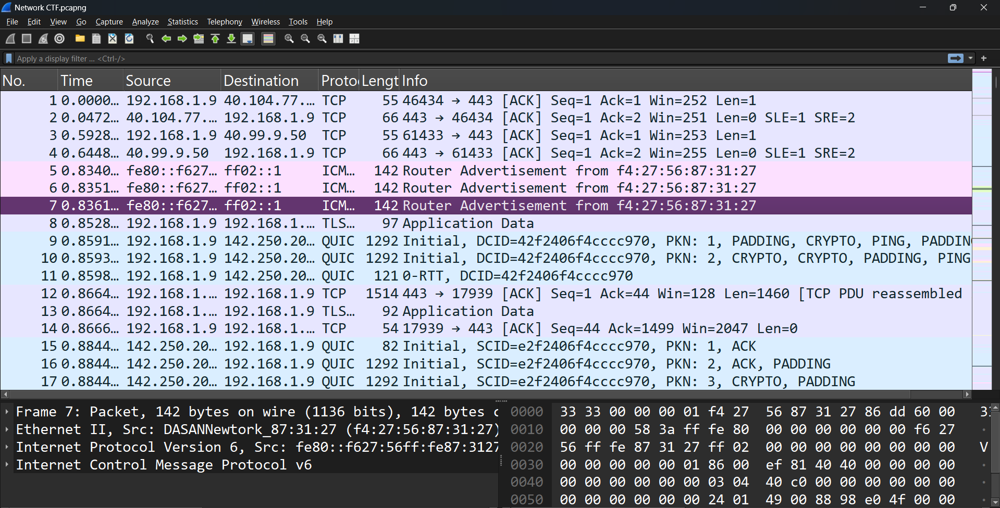

# Wireshark Job-Ready Guide

This repository is a job-ready walkthrough for mastering Wireshark through hands-on packet analysis.

The goal is simple: build practical, industry-relevant packet analysis skills that map directly to real security and network roles.

## What is Wireshark?

Wireshark is a free and open-source packet analyzer used for:

- Network troubleshooting
- Traffic analysis
- Protocol development and debugging
- Security investigations
- Learning how networks behave

It provides a graphical interface to capture and inspect packets in real time.

## Repository Contents

- `net_ctf.pcapng`: sample capture file for practice
- `wireshark_window.png`: reference screenshot of the Wireshark interface
- `readme.md`: this guide

## Installation

Download Wireshark from the official website:

- https://www.wireshark.org/

> Note: This guide was written on Windows. Some steps may look slightly different on Linux or macOS.

## Why Use Wireshark?

Wireshark helps you answer practical questions such as:

- Which hosts are communicating?
- Which protocols are most active?
- Are there suspicious or malformed packets?
- Why is an application connection failing?

## Understanding the Wireshark UI

The main window is split into these sections:

1. **Packet List Pane**
    Shows all captured packets with summary fields such as time, source, destination, protocol, and length.
2. **Packet Details Pane**
    Displays the protocol tree for the selected packet. Expand each layer to inspect fields.
3. **Packet Bytes Pane**
    Shows raw packet bytes in hexadecimal and ASCII.
4. **Display Filter Bar**
    Lets you filter visible packets using expressions (for example, `http`, `ip.addr == 192.168.1.10`, `tcp.port == 443`).
5. **Toolbar**
    Provides quick actions for starting/stopping capture, opening files, and exporting results.
6. **Status Bar**
    Displays packet counts and filter statistics.

## Recommended Starter Video

If you are new to the tool, this tutorial is a solid starting point:

- https://youtu.be/w6kIER4SFhQ?si=qTKab-j-oDJ2X_Oz

## Setup Checklist

Before you begin analysis, configure your workspace for speed and clarity:

- Create a custom profile
- Adjust pane layout to your preference
- Enable useful coloring rules
- Save common display filters
- Add custom columns (for example: source port, destination port, stream index)

## Capturing Your First Packets

1. Open Wireshark.
2. Select the correct network interface (usually Wi-Fi or Ethernet).
3. Click **Start** to begin capture.
4. Generate traffic (browse a site, run a ping, open an app).
5. Click **Stop** when enough traffic is collected.

### Pre-Capture Best Practices

- Install the required capture drivers (Npcap on Windows is the common choice).
- Run with the required privileges when needed.
- Select the correct interface, capturing from the wrong one gives empty or irrelevant data.
- Enable promiscuous mode only when necessary.
- Choose an appropriate snapshot length (`snaplen`) to avoid truncating important payload data.
- Configure output rotation by size or time to prevent very large single capture files.
- Double-check all settings before starting long captures.

## Analyze the Included Capture

This project includes a practice capture file:

- `net_ctf.pcapng`

Open it in Wireshark to follow along with analysis.

## Basic Recon Workflow

When opening a capture, start with quick reconnaissance:

1. Check total capture size and packet count from "Capture File Properties" window as showin in the image
Menu > Statistics > Capture File Properties
 /capture_properties.png 

2. Identify top protocols in use.
Menu > Statistics > Protocol Hierarchy 

3. Top Conversations (You can do this in Step 4 with more precision by filtering)
Menu → Statistics → Conversations

4. Apply filters to  dig up important, conversations, ports and protocols.
Menu → Statistics → Conversations → IPv4 tab

Report:

Top 3 IPs by packet count
Which one is 192.168.1.111?
How many packets is it generating?

5. Review conversation statistics to find the most important hosts and flows.

From there, you can pivot into protocol-specific investigation (HTTP, DNS, TLS, TCP streams, and so on).

## Professional Outcomes

By following this guide and practicing on the included `.pcapng` file, you will develop essential skills expected in professional network analysis workflows:

- Packet capture and capture hygiene
- Precision filtering and rapid data isolation
- Flow-based investigation and protocol-driven analysis
- Traffic triage approaches used in professional security and operations environments

